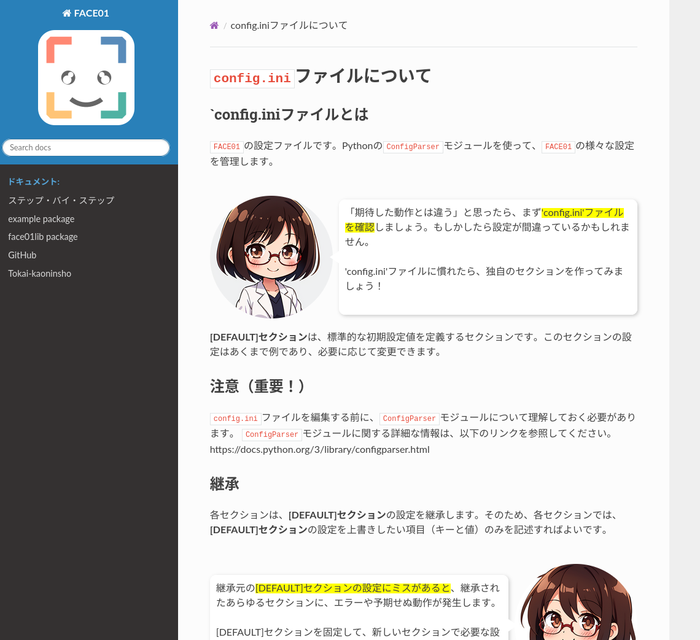

## はじめに
顔画像データセットを作成する際、一般的にはクローリングによって作成するかと思います。
この方法だとデータのクリーニングが大変です。
- 自撮り加工が大変多い
- 関連した別人が混ざる
- 年齢差が大きすぎるデータが混ざる
- ぼやけている
これらを最終的には目視で行わなければなりません。
`JAPANESE FACE V1`[^1]を作製した時は、最終チェックはすべて目視で行いました。
[^1]: [日本人顔認識のための学習モデル](https://github.com/yKesamaru/FACE01_trained_models)

これとは異なる方法として、インタビューなどの動画から顔画像データを抽出する方法も存在します。
人数をかせぐことは出来ませんが、上記のデメリットはすべて解消されます。

この記事では後者の「インタビューなどの動画から顔画像データを抽出する方法」について、`FACE01`[^2]を使って行います。
[^2]: [FACE01は日本人の顔に最適化された顔学習モデルJAPANESE FACEと、Pythonで書かれたオープンソースのリファレンス実装です。](https://github.com/yKesamaru/FACE01_DEV)


- [はじめに](#はじめに)
- [ホスト環境](#ホスト環境)
- [環境構築](#環境構築)
  - [FACE01をDOCKERで導入](#face01をdockerで導入)
- [FACE01を使用する](#face01を使用する)
  - [コンテナを起動する](#コンテナを起動する)
  - [Python仮想環境をアクティベートする](#python仮想環境をアクティベートする)
  - [ホストディレクトリが繋がっているか確認する](#ホストディレクトリが繋がっているか確認する)
  - [`config.ini`を調整する](#configiniを調整する)
  - [顔画像ファイルを設置する](#顔画像ファイルを設置する)
  - [エグザンプルコードを動作させる](#エグザンプルコードを動作させる)
  - [ホスト側に顔画像ファイルを移動する](#ホスト側に顔画像ファイルを移動する)
- [おわりに](#おわりに)


## ホスト環境
```bash
$ inxi -Sxxx --filter
System:
  Kernel: 6.8.0-47-generic x86_64 bits: 64 compiler: N/A Desktop: GNOME 42.9
    tk: GTK 3.24.33 wm: gnome-shell dm: GDM3 42.0
    Distro: Ubuntu 22.04.5 LTS (Jammy Jellyfish)
```

今回、YouTubeの[巨人 阿部監督の試合後インタビュー【巨人×DeNA】【CSファイナル第5戦】](https://www.youtube.com/watch?v=VIfRh7WF_ds)を`interview.mp4`として使用します。

> `FACE01`は`RTSP`、`HTTP`などの入力を使用できますが、今回はそこが主眼ではないので予め`interview.mp4`として用意しました。

## 環境構築
### FACE01をDOCKERで導入
[下記](https://ykesamaru.github.io/FACE01_DEV/step_by_step/docker.html)に書いてあるとおりに`Docker image`をプルします。


```bash
docker pull tokaikaoninsho/face01_gpu
```

確認。（ここでは予めダウンロードしておいた`Docker image`がリストされています。）

```bash
$ docker images
REPOSITORY                     TAG        IMAGE ID       CREATED        SIZE
tokaikaoninsho/face01_gpu      3.0.03_3   ce2952ad62d6   2 months ago   22.3GB
```

[ドキュメント](https://ykesamaru.github.io/FACE01_DEV/step_by_step/docker.html#dockerguixhost)にあるように、GUIを使えるようにしておきます。

```bash
xhost +local:
```

この部分がよくわからない方は[以下](https://zenn.dev/ykesamaru/articles/add7d844f56516)を参考にしてください。

`DockerでGUIアプリケーションを開く基本的な押さえどころ`

https://zenn.dev/ykesamaru/articles/add7d844f56516

## FACE01を使用する
### コンテナを起動する

永続化のためのフォルダを指定しておきたいので、[以下のようにしてコンテナを起動](https://ykesamaru.github.io/FACE01_DEV/step_by_step/docker.html#dockerguixhost)します。

```bash
docker run -it \
    --gpus all -e DISPLAY=$DISPLAY \
    -v /tmp/.X11-unix:/tmp/.X11-unix \
    -v /path/to/host/folder:/path/to/container/folder \
    <image id>
```


以下はドキュメントに実際描かれている内容の転載です。

> ここで、'/path/to/host/folder'はホスト側の永続化したいデータを保存するフォルダパスを指定し、'/path/to/container/folder'はコンテナ内でそのデータを利用するためのフォルダパスを指定します。
> 
> 例えば、ホストの'/home/user/dataフォルダ'をコンテナ内の'/mnt/data'にマウントしたい場合は、以下のようになります。
> 
> ```bash
> docker run -it \
>     --gpus all -e DISPLAY=$DISPLAY \
>     -v /tmp/.X11-unix:/tmp/.X11-unix \
>     -v /home/user/data:/mnt/data \
>     <image id>
> ```

`/home/user/ドキュメント/Face_Extraction/assets/`ディレクトリに`interview.mp4`としてテスト用動画を用意してあります。
今回はこの動画ファイルから顔画像ファイルを抽出したいので、このディレクトリを指定してコンテナを起動します。

```bash
docker run -it \
    --gpus all -e DISPLAY=$DISPLAY \
    -v /tmp/.X11-unix:/tmp/.X11-unix \
    -v /home/user/ドキュメント/Face_Extraction/assets:/mnt/data \
    ce2952ad62d6
```

コンテナを上記のように指定して起動すると、ホスト側の`/home/user/ドキュメント/Face_Extraction/assets`ディレクトリがコンテナ側の`/mnt/data`ディレクトリに接続されます。

```bash
(venv) user@user:~/ドキュメント/Face_Extraction$ docker run -it \
    --gpus all -e DISPLAY=$DISPLAY \
    -v /tmp/.X11-unix:/tmp/.X11-unix \
    -v /home/user/ドキュメント/Face_Extraction/assets:/mnt/data \
    ce2952ad62d6

==========
== CUDA ==
==========

CUDA Version 11.6.1

Container image Copyright (c) 2016-2023, NVIDIA CORPORATION & AFFILIATES. All rights reserved.

This container image and its contents are governed by the NVIDIA Deep Learning Container License.
By pulling and using the container, you accept the user and conditions of this license:
https://developer.nvidia.com/ngc/nvidia-deep-learning-container-license

A copy of this license is made available in this container at /NGC-DL-CONTAINER-LICENSE for your convenience.

*************************
** DEPRECATION NOTICE! **
*************************
THIS IMAGE IS DEPRECATED and is scheduled for DELETION.
    https://gitlab.com/nvidia/container-images/cuda/blob/master/doc/support-policy.md
```

### Python仮想環境をアクティベートする
```bash
docker@056e52013385:~/FACE01_DEV$ . bin/activate
```

### ホストディレクトリが繋がっているか確認する
```bash
(FACE01_DEV) docker@056e52013385:~/FACE01_DEV$ ls /mnt/data
2024-10-23-16-34-21.png  2024-10-23-16-42-37.png  eye-catch.png  interview.mp4
```

`/mnt/data/interview.mp4`に対して、顔画像ファイル抽出処理をしていきます。

### `config.ini`を調整する
`FACE01`の`DOCKER`イメージには`gedit`テキストエディタが付属します。`vim`も付属するので好きな方を選んで起動してください。

```bash
(FACE01_DEV) docker@a5f5d24d9fba:~/FACE01_DEV$ ls
Docker_INSTALL_FACE01.sh  assets  build       docs     face01lib  lib    noFace  preset_face_images  pyvenv.cfg            share
SystemCheckLock           bin     config.ini  example  include    lib64  output  pyproject.toml      requirements_dev.txt
(FACE01_DEV) docker@a5f5d24d9fba:~/FACE01_DEV$ gedit config.ini 

(gedit:34): dbind-WARNING **: 19:16:54.532: Couldn't connect to accessibility bus: Failed to connect to socket /run/user/1000/at-spi/bus_1: そのようなファイルやディレクトリはありません

** (gedit:34): WARNING **: 19:16:54.880: Could not load theme icon text-x-generic: Icon 'text-x-generic' not present in theme Yaru-red
```


基本的に`FACE01`は`config.ini`ファイルを編集して設定を行います。

デフォルトで幾つかのセクションが用意されています。すべてのセクションは`[DEFAULT]`セクションを継承します。
新しいセクションを作成するには`[DEFAULT]`セクションから変更する部分だけを抽出して設定してください。

くわしくは[こちら](https://ykesamaru.github.io/FACE01_DEV/step_by_step/config_ini.html)をご参照ください。



今回は予め用意されている`[DISPLAY_GUI]`セクションを元に内容を変更します。

```bash
[DISPLAY_GUI]
# [DISPLAY_GUI] section is example for display window.
# [DISPLAY_GUI] section inherits from the [DEFAULT] section.
headless = False
deep_learning_model = 1
similar_percentage = 90
preset_face_images_jitters = 10
min_detection_confidence = 0.8
mode = cnn
use_pipe = False
same_time_recognize = 1
movie = interview.mp4
target_rectangle = True
show_overlay = True
show_percentage = True
show_name = True
frame_skip = 2
number_of_crops = 0
```

### 顔画像ファイルを設置する
次に、`interview.mp4`からとった顔画像ファイルを保存します。


これを以下のディレクトリにコピーします。

`~/FACE01_DEV/preset_face_images/`

コピーする際パスワードを聞かれます。パスワードは`docker`です。

```bash
(FACE01_DEV) docker@a5f5d24d9fba:~/FACE01_DEV$ ls /mnt/data
2024-10-23-16-34-21.png  2024-10-23-19-17-39.png  eye-catch.png  interview.mp4
2024-10-23-16-42-37.png  2024-10-23-20-32-42.png  face_crop.py   阿部慎之助_default.png
(FACE01_DEV) docker@a5f5d24d9fba:~/FACE01_DEV$ cp /mnt/data/阿部慎之助_default.png ~/FACE01_DEV/preset_face_images/
cp: 通常ファイル '/home/docker/FACE01_DEV/preset_face_images/阿部慎之助_default.png' を作成できません: 許可がありません
(FACE01_DEV) docker@a5f5d24d9fba:~/FACE01_DEV$ sudo !!
sudo cp /mnt/data/阿部慎之助_default.png ~/FACE01_DEV/preset_face_images/
[sudo] docker のパスワード: 
```


### エグザンプルコードを動作させる
コードは[`example/display_GUI_window.py`](https://github.com/yKesamaru/FACE01_DEV/blob/master/example/display_GUI_window.py#L1)を使用します。

https://github.com/yKesamaru/FACE01_DEV/blob/1cab4e4ceeeea45888d4f54f6c8da1be34e46b52/example/display_GUI_window.py#L1-L123

```bash
(FACE01_DEV) docker@b8ddca6a1b03:~/FACE01_DEV$ python ./example/display_GUI_window.py
```


### ホスト側に顔画像ファイルを移動する
```bash
(FACE01_DEV) docker@b8ddca6a1b03:~/FACE01_DEV$ mv ./output/*.png /mnt/data/output/
```

これによって、ホスト側にクロップされた顔画像ファイルを移しました。


## おわりに


